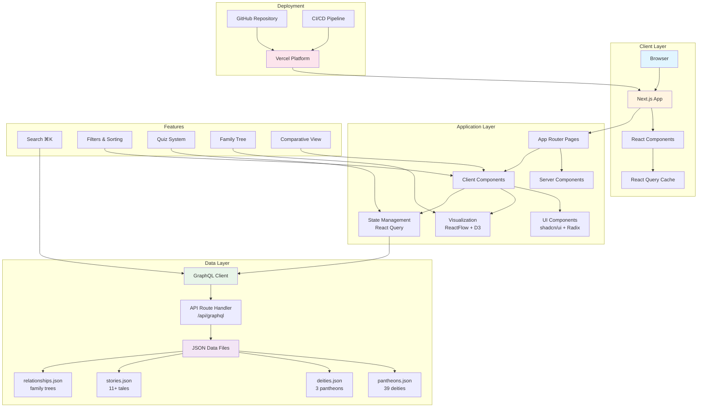
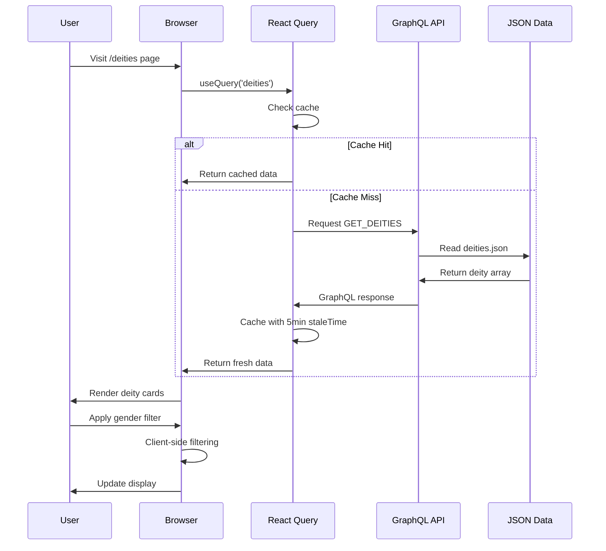
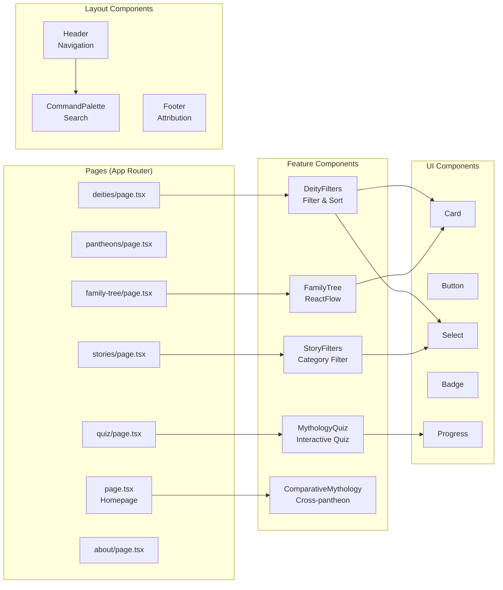
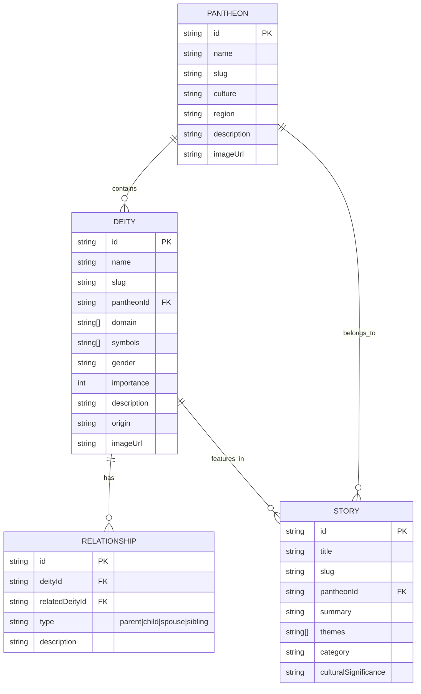
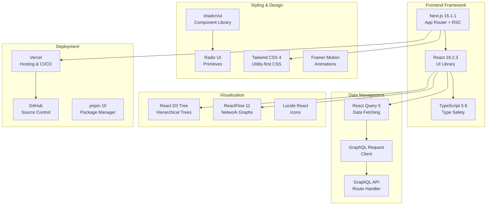
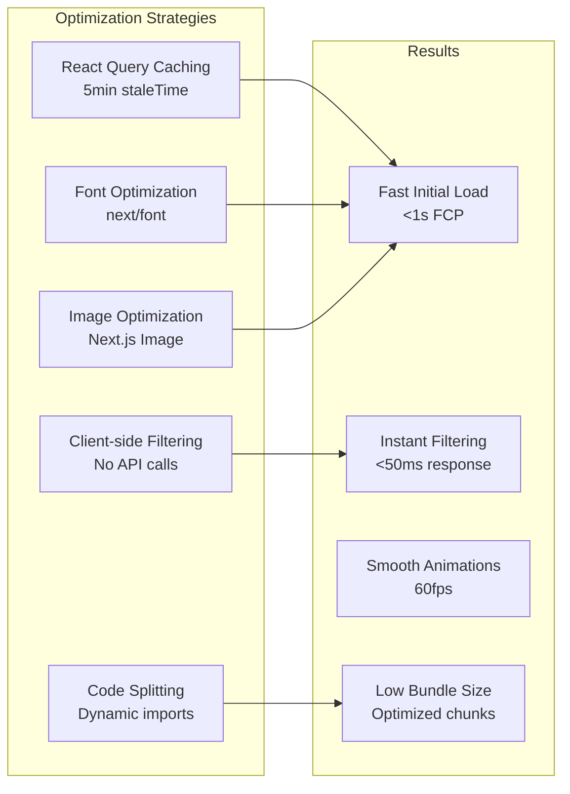
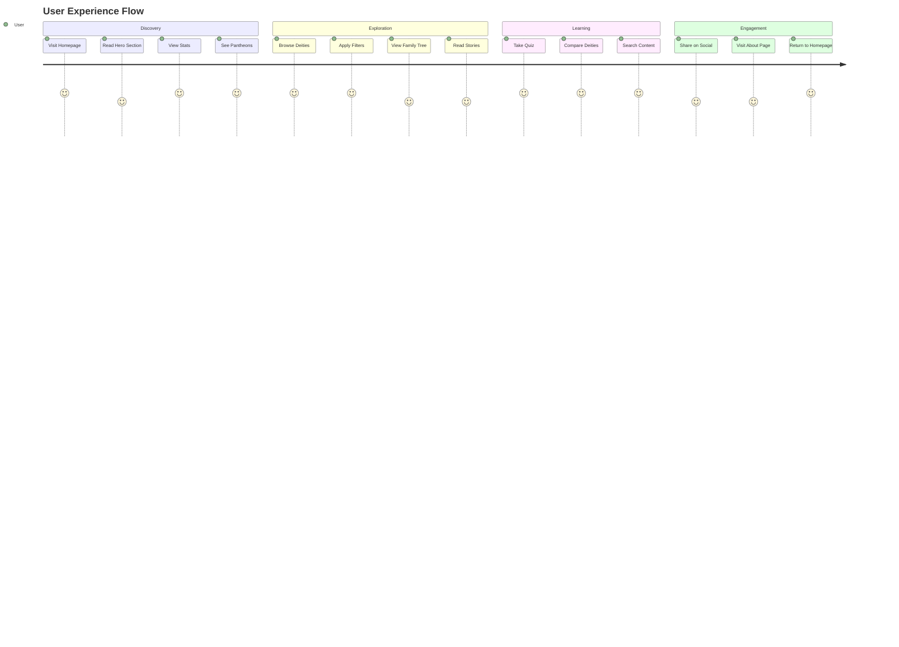
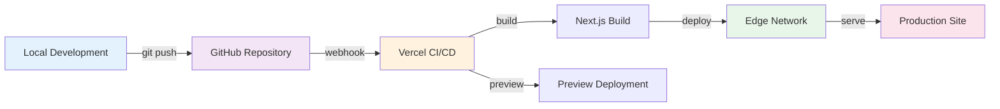

# Mythos Atlas Architecture

> Comprehensive system architecture documentation

## System Overview

Mythos Atlas is a modern, interactive web application built with Next.js 16 and React 19, featuring a GraphQL API layer for flexible data querying and real-time client-side data management.

## Architecture Diagram

## Data Flow Diagram

## Component Architecture

## Database Schema (JSON)

## Technology Stack

## Feature Matrix

| Feature | Status | Technology | Performance |
|---------|--------|------------|-------------|
| Homepage | ✅ Live | Next.js SSR | A+ |
| Pantheons Browser | ✅ Live | React Query | A+ |
| Deity Filtering | ✅ Live | Client-side | A+ |
| Story Filtering | ✅ Live | Client-side | A+ |
| Family Tree (Network) | ✅ Live | ReactFlow | A |
| Family Tree (Hierarchical) | ✅ Live | React D3 Tree | A |
| Global Search | ✅ Live | Command Palette | A+ |
| Interactive Quiz | ✅ Live | React State | A+ |
| Comparative Mythology | ✅ Live | React Query | A+ |
| Mobile Responsive | ✅ Live | Tailwind | A+ |
| SEO Optimization | ✅ Live | Next.js Metadata | A+ |
| Custom 404 | ✅ Live | Next.js | A+ |

## Performance Optimization

## User Journey

## Deployment Pipeline

## Creator

**Built by Elizabeth Stein** - February 2026

Combining modern web technologies with a passion for ancient mythology to create an immersive educational experience.

---

*For more information, see [README.md](./README.md)*
