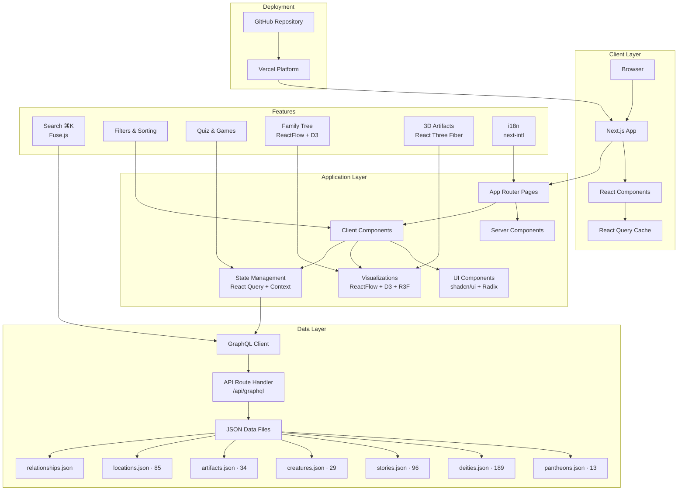
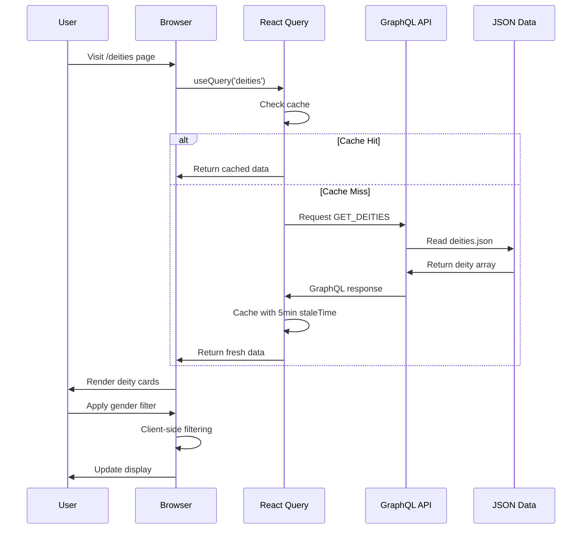
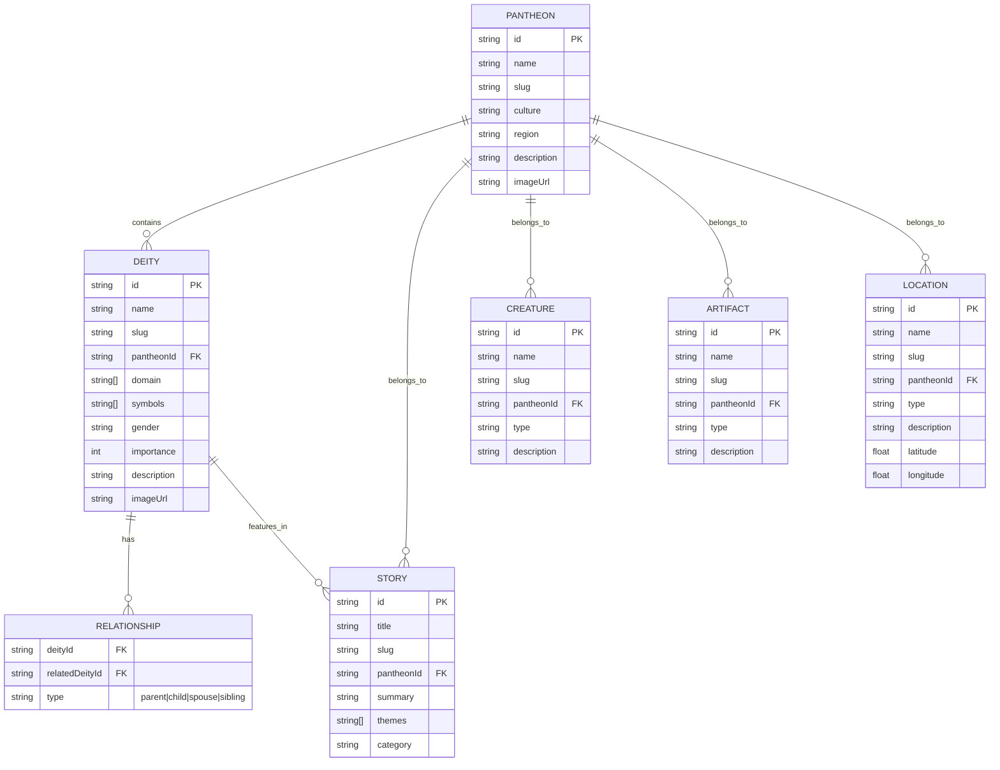
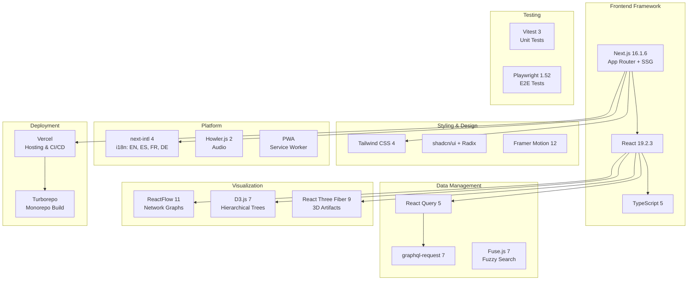
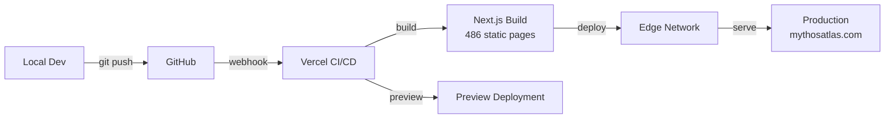

# Mythos Atlas Architecture

> System architecture documentation

## System Overview

Mythos Atlas is an interactive mythology encyclopedia built with Next.js 16 and React 19. It serves structured mythology data (13 pantheons, 189 deities, 96 stories, 29 creatures, 34 artifacts, 85 locations) through a GraphQL API layer backed by JSON files, with client-side caching via React Query.

## Architecture Diagram

## Data Flow

## Data Schema

## Technology Stack

## Feature Overview

| Area          | Features                                                                                           |
| ------------- | -------------------------------------------------------------------------------------------------- |
| **Browse**    | 13 pantheons, 189 deities, 96 stories, 29 creatures, 34 artifacts, 85 locations                    |
| **Visualize** | Family trees (network + hierarchical), knowledge graph, story timeline, 3D artifacts, location map |
| **Learn**     | Relationship quiz, personality quiz, quick quiz, symbol memory game, spaced repetition review      |
| **Progress**  | Achievements (24 badges), leaderboard, daily challenges, learning paths, streaks                   |
| **Search**    | ⌘K command palette, fuzzy search (Fuse.js), client-side filters & sorting                          |
| **Media**     | Text-to-speech, background audio per pantheon, PDF export                                          |
| **Platform**  | i18n (4 languages), PWA with offline support, dynamic OG images, SEO metadata                      |

## Performance

- **React Query** — 5-minute stale time; client-side filter/sort avoids API round-trips
- **Static Generation** — 486 pages pre-rendered at build time
- **Code Splitting** — Dynamic imports for heavy visualization components (ReactFlow, D3, R3F)
- **Image Optimization** — WebP hero images, Next.js `<Image>` with lazy loading
- **Font Subsetting** — Latin-ext subset for i18n support

## Deployment

---

_See [README.md](./README.md) for setup instructions and full feature details._
