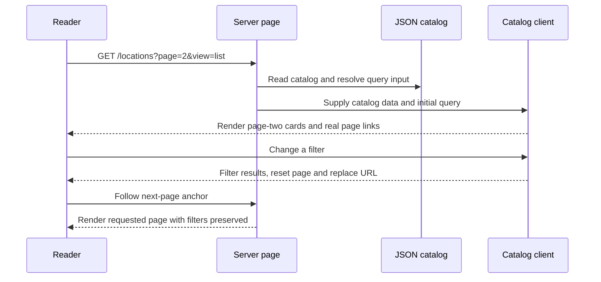
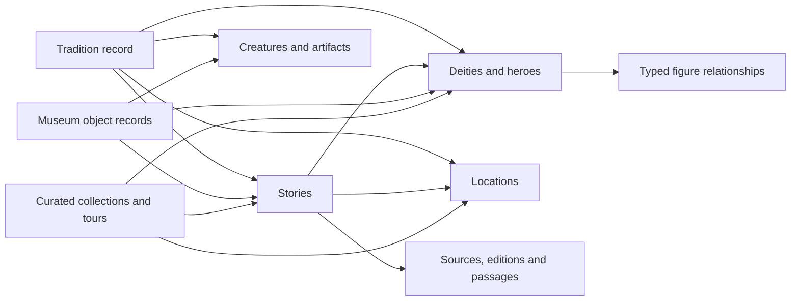
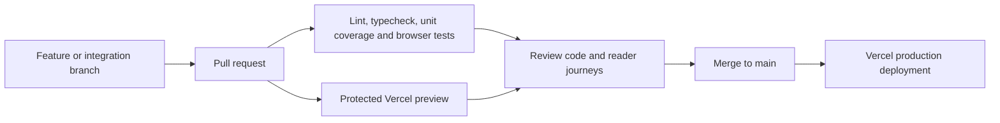

# Mythos Atlas architecture

Verified against the repository on September 23, 2026. This describes the web app as implemented, not every earlier prototype or a guarantee about the currently deployed production build.

## Runtime and data boundaries

`apps/web` is a self-contained Next.js App Router application. Its encyclopedia data comes from versioned JSON in `src/data/`; a database is not required to browse the site. Pages use server-side catalog lookups and client-side filtering/interaction. The separate `/api/graphql` route exposes the JSON catalog, but normal encyclopedia pages do not all fetch through GraphQL or React Query.

`apps/api` is an optional Rust/Axum/async-graphql service with PostgreSQL migrations and seed data. It is not a dependency of the web app's current catalog browsing path.

```mermaid
flowchart TB
    Browser[Reader browser] --> Pages[Next.js App Router pages]
    Pages --> Server[Server lookups, metadata and structured data]
    Catalog[Versioned JSON catalogs] --> Server
    Server --> HTML[Rendered HTML and client props]
    HTML --> Client[Interactive React components]
    Client --> Local[Local storage: bookmarks, progress, reviews]
    Client --> Visual[On-demand maps, graphs and audio]
    Browser --> GraphQL[Optional web API: /api/graphql]
    Catalog --> GraphQL
    Browser --> Support[Support page]
    Support --> Stripe[Stripe-hosted one-time checkout]
    Browser -. optional Oracle .-> Oracle[/api/oracle]
    Oracle --> Limits[Upstash rate limits and daily cap]
    Oracle --> Provider[Configured Anthropic or Groq model]
    Catalog --> Oracle
    Rust[Separate optional Rust API] --> Postgres[PostgreSQL]
```

The main catalogs currently contain 19 tradition records, 261 deities, 30 heroes, 121 stories, 71 creatures, 56 artifacts, and 138 locations. These are catalog counts, not claims that every tradition is equally covered or every passage has received scholarly review.

## Catalog navigation

Heroes and Locations resolve query parameters in server page wrappers. Their client components initialize page/filter state from those parameters, update the address as filters change, and render actual pagination anchors. Filter changes return to page one. Location era membership is applied before the first render. A pagination link opens the list on mobile; an explicitly selected map view survives a direct load.

```mermaid
sequenceDiagram
    participant Reader
    participant Page as Server page
    participant Data as JSON catalog
    participant Client as Catalog client
    Reader->>Page: GET /locations?page=2&view=list
    Page->>Data: Read catalog and resolve query input
    Page->>Client: Supply catalog data and initial query
    Client-->>Reader: Render page-two cards and real page links
    Reader->>Client: Change a filter
    Client-->>Reader: Filter results, reset page and replace URL
    Reader->>Page: Follow next-page anchor
    Page-->>Reader: Render requested page with filters preserved
```

Direct entity pages resolve aliases and missing records before rendering. Native JSON-LD script elements serialize structured data into server HTML with `<` escaped. Collection schemas belong on the route describing that collection, not an inherited layout that also wraps unrelated detail pages. A pantheon detail route describes its collection of figures and intentionally supplies its own collection schema.

## Content relationships

The JSON files form an application-level catalog, not relational tables. References are validated in tests. Museum objects can connect to multiple catalog entries; translations, editions, passage locators, and uncertainty notes are part of the editorial evidence rather than interchangeable external links.

```mermaid
flowchart LR
    Tradition[Tradition record] --> Figures[Deities and heroes]
    Tradition --> Stories[Stories]
    Tradition --> Places[Locations]
    Tradition --> Objects[Creatures and artifacts]
    Figures --> Relations[Typed figure relationships]
    Stories --> Figures
    Stories --> Places
    Stories --> Sources[Sources, editions and passages]
    Museum[Museum object records] --> Figures
    Museum --> Stories
    Museum --> Objects
    Collections[Curated collections and tours] --> Figures
    Collections --> Stories
    Collections --> Places
```

See [entity types](apps/web/src/types/Entity.ts), [catalog schemas](apps/web/src/lib/schemas.ts), and the [GraphQL route](apps/web/src/app/api/graphql/route.ts) for actual fields. GraphQL imports the Zod-inferred schema types; keep these consistent with the separate entity interfaces.

## State, privacy and optional services

- `src/app/layout.tsx` owns the provider stack: locale, theme, React Query, bookmarks, progress, review, leaderboard, and achievement notifications. Saved learning state is browser-local; it is not an account-backed cross-device service.
- Search loads on command-palette intent. Audio controls and playback are optional. Achievement notifications default off.
- Vercel analytics, Web Vitals, and Sentry browser collection are consent-gated. Global Privacy Control takes precedence over analytics opt-in. Session replay is off by default.
- Oracle requires explicit enablement and credentials. Production requests fail closed without Upstash for both Anthropic and Groq. Shared per-IP limits and the global daily cap require Upstash; only development can fall back to in-memory limits. The kill switch disables Oracle and story-quiz generation. No Oracle key belongs in browser code.
- `/support` links to Stripe's hosted optional one-time checkout. The site does not collect card numbers, grant paid access, or claim a payment succeeded from an unverified query parameter. Stripe is the transaction record; no checkout session endpoint or webhook was added for this flow.
- Navigation/Oracle locale choices support EN, ES, FR, and DE. Most encyclopedia prose remains English.
- Service-worker generation is disabled in `next.config.ts`. An offline-status indicator and optional install UI are not a guarantee of offline encyclopedia access.

## Build and release

The web app uses Next.js 16, React 19, TypeScript 6, Tailwind 4, Vitest 4, and Playwright. Exact versions belong in the manifests and lockfile. Node is pinned in `.nvmrc`; pnpm is pinned by `packageManager`. Production builds use the configured webpack pipeline. Fonts are bundled local WOFF2 files with licenses, so builds do not need to download Google Fonts.

```mermaid
flowchart LR
    Work[Feature or integration branch] --> PR[Pull request]
    PR --> Checks[Lint, typecheck, unit coverage and browser tests]
    PR --> Preview[Protected Vercel preview]
    Checks --> Review[Review code and reader journeys]
    Preview --> Review
    Review --> Main[Merge to main]
    Main --> Production[Vercel production deployment]
```

A preview does not mean production was promoted. Do not bypass failing checks or assume an old passing run covers a new commit. Preserve unique commits and dirty worktrees before branch cleanup. The optional Rust service needs separate database-backed validation if it changes.

## Performance and verification

Use [the performance record](docs/audits/2026-09-18-performance.md) for measured results and limitations. Catalog descriptions, complete stories, and unrelated entity biographies should not be shipped merely to populate a browse card. Maps/graphs remain separately loaded; museum images retain their tested delivery policy until optimization is verified against the upstream host.

[The improvement plan](docs/audits/2026-09-22-improvement-plan.md) and [QA evidence](docs/audits/2026-09-22-qa-results.json) distinguish scoped automated checks, preview verification, and unfinished editorial/reader research. Build route counts and local Lighthouse scores are observations, not permanent architecture properties or field performance guarantees.
