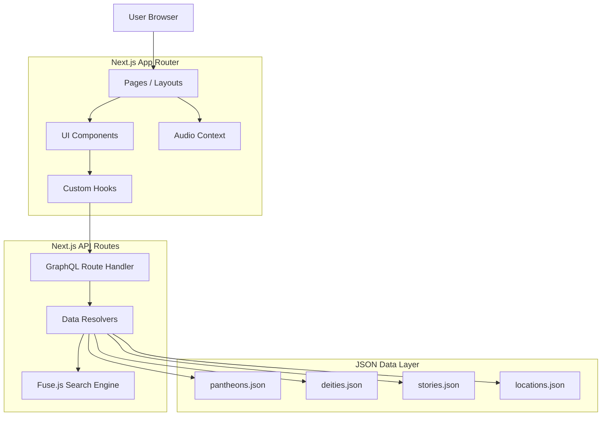

# Mythos Atlas

> **Interactive encyclopedia of world mythology**

An immersive web application exploring ancient mythologies through interactive visualizations, comprehensive deity profiles, epic stories, and educational features. Currently featuring Greek, Norse, and Egyptian pantheons with 39 deities and 11+ legendary tales.

## ✨ Features

### 🏛️ **Explore Pantheons**
- Greek, Norse, and Egyptian mythologies (with Roman, Hindu, and Japanese planned)
- Cultural context and historical background
- Divine hierarchies and pantheon structures

### 👑 **Discover Deities**
- 39 detailed deity profiles with domains, symbols, and attributes
- **Advanced Filtering**: Filter by gender, domain (war, love, wisdom, etc.)
- **Smart Sorting**: Sort by importance rank or alphabetical name
- Interactive search with ⌘K keyboard shortcut

### 📖 **Read Epic Stories**
- 11+ mythological tales and legends
- **Story Filtering**: Browse by category and themes
- Creation myths, heroic quests, and divine conflicts
- Cultural significance and moral themes

### 🌳 **Interactive Family Trees**
- Visual relationship networks using ReactFlow
- Hierarchical tree view with D3
- Color-coded relationships (parent, child, spouse, sibling)
- Zoom, pan, and explore divine genealogies
- Mobile-responsive with touch controls

### 🔍 **Comparative Mythology**
- Cross-pantheon deity comparisons
- Discover parallels across cultures
- See how different civilizations portrayed similar domains

### 🔊 **Audio & Ambiance**
- Immersive background audio for each pantheon
- Global volume control with mute/unmute
- Sound effects for interactive elements

### 🏛️ **3D Artifacts**
- Interactive 3D visualization of legendary items
- Examine relics like the Golden Apple or Shields from all angles
- Procedurally generated 3D meshes using React Three Fiber

### 🗺️ **Locations Map**
- Interactive map to explore mythical sites
- Filter by Pantheon and Location Type (Temple, City, Underworld)
- Visualizing sacred geography across the ancient world

### 🗣️ **Accessibility**
- **Text-to-Speech**: Listen to long-form stories with one click
- Keyboard navigable interface
- **Fuzzy Search**: Find content even with typos (e.g., "Zues" -> "Zeus")

## 🏗️ Architecture



## 🛠️ Tech Stack

### Frontend
- **Next.js 16.1.1** - React framework with App Router
- **React 19.2.3** - UI library
- **TypeScript** - Type-safe development
- **Tailwind CSS 4** - Modern styling
- **React Query** - Data fetching and caching
- **ReactFlow** - Network graph visualization
- **D3.js & React-D3-Tree** - Data visualizations
- **React Three Fiber** - 3D Rendering
- **Howler.js** - Audio management
- **Framer Motion** - Smooth animations
- **shadcn/ui** - Beautiful UI components

### Backend & Data
- **GraphQL API** - Flexible data querying
- **Fuse.js** - Fuzzy search engine
- **Next.js API Routes** - Serverless functions

### Deployment
- **Vercel** - Hosting and CI/CD
- **GitHub** - Source control

## 🚀 Getting Started

### Prerequisites

- **Node.js 20+** and **pnpm 10+**

### Installation

```bash
# Clone the repository
git clone git@github.com:forbiddenlink/mythos.git
cd mythos

# Install dependencies
pnpm install

# Run development server
cd apps/web
pnpm dev
```

The application will be available at `http://localhost:3000`.

### Production Deployment

The site is live at: **https://mythos-web-seven.vercel.app**

## 📁 Project Structure

```
mythos/
├── apps/
│   ├── web/              # Next.js frontend application
│   │   ├── src/
│   │   │   ├── app/      # App Router pages and layouts
│   │   │   ├── components/  # React components
│   │   │   ├── data/     # JSON mythology data files
│   │   │   ├── lib/      # Utilities and GraphQL client
│   │   │   └── types/    # TypeScript definitions
│   │   └── public/       # Static assets
│   └── api/              # Rust backend (planned)
├── packages/             # Shared packages
├── tools/                # Build tools
└── turbo.json           # Turborepo configuration
```

## 🗄️ Data Structure

The application uses JSON files for mythology data:

- **pantheons.json** - 3 pantheons (Greek, Norse, Egyptian)
- **deities.json** - 39 detailed deity profiles
- **stories.json** - 11+ epic tales and legends
- **relationships.json** - Divine family connections

## 🧪 Development Commands

```bash
# Run frontend development server
cd apps/web
pnpm dev

# Build for production
pnpm build

# Run production build
pnpm start

# Lint code
pnpm lint
```

## 🎯 Current Status (February 2026)

### ✅ Completed Features
- Homepage with hero, features, stats, and CTA sections
- Pantheons page with Greek, Norse, Egyptian cards
- Deities page with filtering (gender, domain) and sorting
- Stories page with category and theme filtering
- Family tree with network graph and hierarchical views
- Interactive quiz with progress tracking
- Comparative mythology section
- Global search with ⌘K command palette
- Full mobile responsiveness
- SEO metadata and OpenGraph tags
- Custom 404 page

### 🚧 Planned Enhancements
- Roman, Hindu, and Japanese pantheons
- Deity profile images
- Story illustrations
- Additional quiz modes
- User favorites and bookmarks
- Print/export functionality

## 👤 Creator

**Built by Elizabeth Stein** - A passionate developer and mythology enthusiast combining technical expertise with a deep appreciation for ancient cultures and storytelling.

*"This project was born from a fascination with how ancient myths connect cultures across time and space. By leveraging modern web technologies, I wanted to create an immersive experience that brings these timeless stories to life for a new generation."*

## 📄 License

MIT License - See LICENSE file for details

## 🤝 Contributing

Contributions welcome! Please:
1. Fork the repository
2. Create a feature branch (`git checkout -b feature/amazing-feature`)
3. Commit your changes (`git commit -m 'Add amazing feature'`)
4. Push to the branch (`git push origin feature/amazing-feature`)
5. Open a Pull Request

---

**Mythos Atlas** • Built with ❤️ by Elizabeth Stein • February 2026
