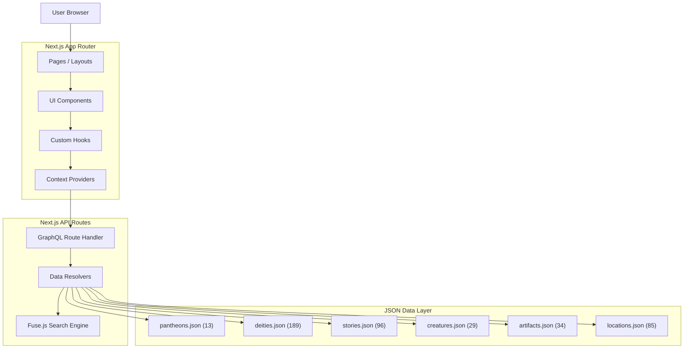

# Mythos Atlas

> **Interactive encyclopedia of world mythology**

An immersive web application exploring ancient mythologies through interactive visualizations, comprehensive deity profiles, epic stories, and educational features. Featuring **13 pantheons**, **189 deities**, **96 stories**, **29 creatures**, **34 artifacts**, and **85 mythological locations** spanning cultures from Greek and Norse to Aztec and Polynesian.

## ✨ Features

### 🏛️ **Explore Pantheons**

- **13 mythological traditions**: Greek, Norse, Egyptian, Roman, Hindu, Japanese, Celtic, Aztec, Chinese, Mesopotamian, African (Yoruba), Polynesian, and Mesoamerican
- Cultural context, historical background, and divine hierarchies
- Dedicated pantheon pages with deity rosters and associated stories

### 👑 **Discover Deities**

- **189 detailed deity profiles** with domains, symbols, and attributes
- **Advanced Filtering**: Filter by gender, domain (war, love, wisdom, etc.), and pantheon
- **Smart Sorting**: Sort by importance rank or alphabetical name
- Interactive search with ⌘K keyboard shortcut

### 📖 **Read Epic Stories**

- **96 mythological tales** and legends across all pantheons
- **Interactive Branching Stories**: Choose-your-own-adventure mythology narratives
- Creation myths, heroic quests, and divine conflicts
- Category and theme filtering

### 🌳 **Interactive Family Trees**

- **Network Graph**: ReactFlow-powered interactive nodes with drag, zoom, and pan
- **Hierarchical Tree**: D3.js-powered lineage views
- **Multi-Pantheon Support**: Trees for all 13 pantheons
- Color-coded relationships (parent, child, spouse, sibling)
- Mobile-responsive with touch controls

### 🔍 **Comparative Mythology**

- Cross-pantheon deity comparisons
- Discover parallels across cultures
- Side-by-side domain and attribute analysis

### 🗺️ **Locations & Journeys**

- **85 mythological locations** on an interactive map
- Filter by pantheon and location type (Temple, City, Underworld, etc.)
- **3 guided journeys** through mythological landscapes

### 🐉 **Creatures & Artifacts**

- **29 mythological creatures** with detailed profiles
- **34 legendary artifacts** with interactive 3D visualization (React Three Fiber)
- Examine relics from all angles with procedurally generated meshes

### 🧠 **Educational Features**

- **Relationship Quiz**: Test knowledge of divine family connections
- **Personality Quiz**: Discover which deity matches your personality
- **Quick Quiz**: Timed mythology trivia
- **Symbol Memory Game**: Match deity symbols to their owners
- **Spaced Repetition Review**: Flashcard system with intelligent scheduling
- **Daily Challenges**: New mythology challenges each day
- **Learning Paths**: Guided progression through mythology topics
- **Achievements & Leaderboard**: Track mastery and compete

### 🔊 **Audio & Ambiance**

- **Text-to-Speech**: Listen to stories with one click
- Immersive background audio for each pantheon
- Global volume control with sound effects

### 🌐 **Internationalization & PWA**

- **4 languages**: English, Spanish, French, and German (via next-intl)
- **Progressive Web App**: Installable with offline support
- Service worker with background sync

### 🗣️ **Accessibility & Search**

- Keyboard-navigable interface
- **Fuzzy Search**: Find content even with typos (e.g., "Zues" → "Zeus")
- Command palette (⌘K / Ctrl+K) for instant navigation
- PDF export for deity and story profiles

## 🏗️ Architecture


```mermaid
graph TD
    User[User Browser]

    subgraph Frontend ["Next.js App Router"]
        Page[Pages / Layouts]
        Comp[UI Components]
        Hooks[Custom Hooks]
        Providers[Context Providers]
    end

    subgraph API ["Next.js API Routes"]
        GraphQL[GraphQL Route Handler]
        Resolvers[Data Resolvers]
        Search[Fuse.js Search Engine]
    end

    subgraph Data ["JSON Data Layer"]
        Pantheons["pantheons.json (13)"]
        Deities["deities.json (189)"]
        Stories["stories.json (96)"]
        Creatures["creatures.json (29)"]
        Artifacts["artifacts.json (34)"]
        Locations["locations.json (85)"]
    end

    User --> Page
    Page --> Comp
    Comp --> Hooks
    Hooks --> Providers
    Providers --> GraphQL

    GraphQL --> Resolvers
    Resolvers --> Search

    Resolvers --> Pantheons
    Resolvers --> Deities
    Resolvers --> Stories
    Resolvers --> Creatures
    Resolvers --> Artifacts
    Resolvers --> Locations
```

## 🛠️ Tech Stack

### Frontend

- **Next.js 16.1.6** — React framework with App Router
- **React 19.2.3** — UI library
- **TypeScript 5** — Type-safe development
- **Tailwind CSS 4** — Utility-first styling
- **React Query 5** — Data fetching, caching, and mutations
- **ReactFlow 11** — Network graph visualization
- **D3.js 7** — Custom data visualizations (family trees, timelines)
- **React Three Fiber 9** / **Three.js** — 3D artifact rendering
- **Framer Motion 12** — Page transitions and UI animations
- **Howler.js 2** — Immersive background audio and SFX
- **next-intl 4** — Internationalization (EN, ES, FR, DE)
- **Lucide React** — Icon system
- **shadcn/ui** — Accessible UI component primitives

### Backend & Data

- **GraphQL API** — Flexible data querying via `graphql-request`
- **Fuse.js** — Client-side fuzzy search engine
- **Next.js API Routes** — Serverless functions
- **Rust API** (planned) — High-performance backend with SQLx + Axum

### Deployment

- **Vercel** — Hosting and CI/CD
- **GitHub** — Source control
- **Turborepo** — Monorepo build orchestration

## 🚀 Getting Started

### Prerequisites

- **Node.js 20+** and **pnpm 10+**

### Installation

```bash
# Clone the repository
git clone git@github.com:forbiddenlink/mythos.git
cd mythos

# Install dependencies
pnpm install

# Run development server
cd apps/web
pnpm dev
```

The application will be available at `http://localhost:3000`.

### Production Deployment

The site is live at: <https://mythosatlas.com>

## 📁 Project Structure

```text
mythos/
├── apps/
│   ├── web/                    # Next.js frontend application
│   │   ├── src/
│   │   │   ├── app/            # App Router pages and layouts
│   │   │   │   ├── [locale]/   # i18n wrapper (en, es, fr, de)
│   │   │   │   ├── achievements/
│   │   │   │   ├── artifacts/
│   │   │   │   ├── compare/
│   │   │   │   ├── creatures/
│   │   │   │   ├── deities/
│   │   │   │   ├── family-tree/
│   │   │   │   ├── games/
│   │   │   │   ├── journeys/
│   │   │   │   ├── knowledge-graph/
│   │   │   │   ├── leaderboard/
│   │   │   │   ├── learning-paths/
│   │   │   │   ├── locations/
│   │   │   │   ├── pantheons/
│   │   │   │   ├── quiz/
│   │   │   │   ├── review/
│   │   │   │   ├── stories/
│   │   │   │   ├── timeline/
│   │   │   │   └── api/graphql/ # GraphQL API route
│   │   │   ├── components/     # React components (~40 directories)
│   │   │   ├── data/           # JSON mythology data files
│   │   │   ├── hooks/          # Custom React hooks
│   │   │   ├── i18n/           # Internationalization config
│   │   │   ├── lib/            # Utilities, GraphQL, game logic
│   │   │   ├── providers/      # Context providers
│   │   │   └── types/          # TypeScript definitions
│   │   ├── messages/           # Translation files (en, es, fr, de)
│   │   └── public/             # Static assets and images
│   └── api/                    # Rust backend (planned)
│       ├── src/                # Axum + SQLx source
│       ├── migrations/         # SQL migration files
│       └── seeds/              # Seed data for 6 pantheons
├── packages/                   # Shared packages
├── tools/                      # Build tools
├── thoughts/                   # Continuity ledgers and handoffs
└── turbo.json                  # Turborepo configuration
```

## 🗄️ Data Structure

The application uses JSON files for mythology data:

| File                 | Count | Description                                                                                                                      |
| -------------------- | ----- | -------------------------------------------------------------------------------------------------------------------------------- |
| `pantheons.json`     | 13    | Greek, Norse, Egyptian, Roman, Hindu, Japanese, Celtic, Aztec, Chinese, Mesopotamian, African (Yoruba), Polynesian, Mesoamerican |
| `deities.json`       | 189   | Detailed profiles with domains, symbols, and importance rankings                                                                 |
| `stories.json`       | 96    | Legends, creation myths, and heroic tales                                                                                        |
| `creatures.json`     | 29    | Mythological beasts and beings                                                                                                   |
| `artifacts.json`     | 34    | Legendary weapons, relics, and objects                                                                                           |
| `locations.json`     | 85    | Sacred sites, realms, and mythological places                                                                                    |
| `relationships.json` | —     | Divine family connections across all pantheons                                                                                   |

## 🧪 Development Commands

```bash
# Run frontend development server
cd apps/web
pnpm dev

# Build for production
pnpm build

# Run production build
pnpm start

# Lint code
pnpm lint

# Run unit tests (Vitest)
pnpm test

# Run E2E tests (Playwright)
pnpm test:e2e
```

## 👤 Creator

**Built by Elizabeth Stein** - A passionate developer and mythology enthusiast combining technical expertise with a deep appreciation for ancient cultures and storytelling.

> "This project was born from a fascination with how ancient myths connect cultures across time and space. By leveraging modern web technologies, I wanted to create an immersive experience that brings these timeless stories to life for a new generation."

## 📄 License

MIT License - See LICENSE file for details

## 🤝 Contributing

Contributions welcome! Please:

1. Fork the repository
2. Create a feature branch (`git checkout -b feature/amazing-feature`)
3. Commit your changes (`git commit -m 'Add amazing feature'`)
4. Push to the branch (`git push origin feature/amazing-feature`)
5. Open a Pull Request

---

**Mythos Atlas** • Built with ❤️ by Elizabeth Stein
